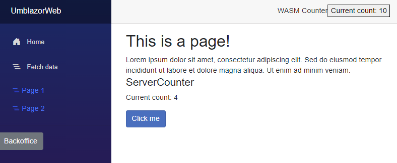

# Umblazor 
 
 
This a POC of how to run Umbraco but having the front-end rendered by Blazor and Razor components instead of the traditional MVC views.

In the Index.razor component there is a wildcard route, a page content loader (for the current slug URL) and a very simple selection of wich "page component" the Model should be passed to.

The page components are located in the Pages folder and are just simple Razor components that can be rendered by the page content loader (Index.razor). Pages should have the same name as the Umbraco Document Type name. 

Interactivity is showcased in the form of simple counter components that can be added to any page and rendered and executed on the server (server side blazor) or on the client (web assembly blazor).

## How to run

1. Clone the repo
2. Enter the web app directory 

``` cd UmblazorWeb ```

3. Start with 

``` dotnet run ```

4. Go to https://localhost:44325 or  http://localhost:57950

Umbraco backoffice is available at https://localhost:44325/umbraco
Login with
```
username: admin@admin.example.com
password: 1234567890
```

